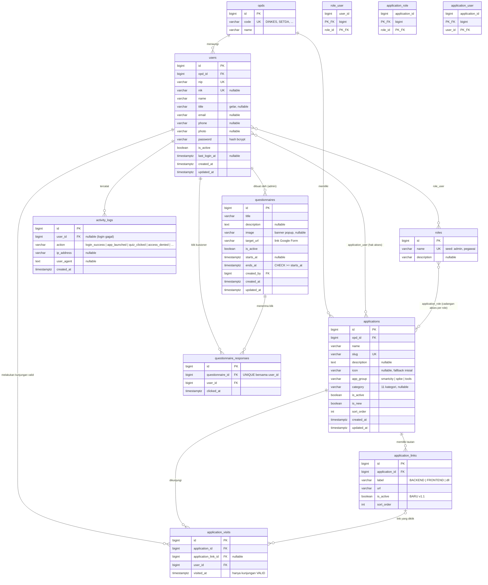

# ERD FINAL — Rebuild E-Office Banyumas

**Versi:** v1.1 FINAL — Juli 2026, pasca-wawancara pembimbing lapangan. Menggantikan v1.0.
**Selaras dengan:** `schema.sql` (v1.1 — sumber kebenaran teknis), `KF_AUTH_RBAC_FINAL.md`, `KF_DASHBOARD_KUISIONER_FINAL.md`
**Database target:** PostgreSQL 17 · **ORM:** Laravel 13 Eloquent

> **Ringkasan perubahan v1.0 → v1.1:**
> | # | Perubahan | Jenis |
> |---|---|---|
> | 1 | `application_links` + kolom **`is_active`** (link dapat dinonaktifkan tanpa dihapus) | Struktur (satu-satunya) |
> | 2 | Makna AB1 berubah: hak akses **menandai** kartu (`can_access`), TIDAK menyembunyikan; seluruh aplikasi selalu dirender | Aturan |
> | 3 | Peluncuran tanpa hak → **403** + pesan (semula 404); TIDAK dicatat ke `application_visits` (konsep **kunjungan valid**) | Aturan |
> | 4 | Role di-seed dua: **`admin`** dan **`pegawai`** (tabel `roles` tetap generik) | Data seed |
> | 5 | Kuisioner terkonfirmasi: link eksternal Google Form; partisipasi = klik tombol; + **rekap per OPD** (via `users.opd_id`) | Konfirmasi |
> | 6 | Seluruh asumsi A1–A5 v1.0 terjawab (lihat §7) — tidak ada lagi bagian "menunggu konfirmasi" | Status |

---

## 1. Diagram ER (Mermaid — dirender otomatis oleh GitHub)



---

## 2. Daftar Relasi & Kardinalitas

| # | Relasi | Kardinalitas | Via | Peran dalam kebutuhan FINAL |
|---|---|---|---|---|
| R1 | opds → users | 1 : N | `users.opd_id` | Info OPD pengguna (FR-D04) + **rekap kuisioner per OPD** (FR-Q25) |
| R2 | opds → applications | 1 : N | `applications.opd_id` | Label OPD di kartu (FR-D16) |
| R3 | users ↔ roles | M : N | `role_user` | Pembeda Admin vs Pegawai (KF Auth §1) |
| R4 | applications ↔ users | M : N | `application_user` | **Sumber utama hak akses** per Pegawai (FR-A09) |
| R5 | applications ↔ roles | M : N | `application_role` | Cadangan akses per role — tidak dipakai di rilis awal, dipertahankan agar penambahan skema akses kelak aditif |
| R6 | applications → application_links | 1 : N | FK + `is_active` | Multi-tombol per kartu (FR-D23); link bisa dinonaktifkan (v1.1) |
| R7 | applications → application_visits | 1 : N | FK | Penghitung kunjungan valid bulan/tahun (FR-D30–D33) |
| R8 | application_links → application_visits | 1 : N (opsional) | FK nullable | Kunjungan per link (KF Dashboard §6) |
| R9 | users → application_visits | 1 : N | FK | Kunjungan selalu oleh user login yang berhak |
| R10 | questionnaires → questionnaire_responses | 1 : N | FK | Penghitung partisipasi klik (FR-Q22) |
| R11 | users → questionnaire_responses | 1 : N | FK + **UNIQUE (questionnaire_id, user_id)** | Satu Pegawai sekali per kuisioner (FR-Q19–Q21) |
| R12 | users → questionnaires | 1 : N | `created_by` | Admin pembuat (FR-Q01) |
| R13 | users → activity_logs | 1 : N | FK nullable | Log pendukung; statistik utama tetap dari R7 & R10 |

---

## 3. Kamus Data (perubahan & kolom kunci; selengkapnya lihat `schema.sql`)

### `application_links` ⬅ berubah di v1.1
| Kolom | Tipe | Constraint | Keterangan |
|---|---|---|---|
| id | bigint | PK, identity | |
| application_id | bigint | FK, NOT NULL, ON DELETE CASCADE | |
| label | varchar(50) | NOT NULL, UNIQUE bersama application_id | BACKEND, FRONTEND, BACKEND V2, FULL CYCLE, dst. |
| url | varchar(500) | NOT NULL | |
| **is_active** | boolean | NOT NULL DEFAULT true | **BARU** — tombol link nonaktif tidak ditampilkan/di-disable tanpa menghapus data |
| sort_order | int | NOT NULL DEFAULT 0 | |

### Tabel lain (tidak berubah dari v1.0)
`opds`, `users` (nip UNIQUE, nik UNIQUE nullable, opd_id RESTRICT), `roles` + `role_user` (composite PK), `applications` (slug UNIQUE; `app_group` CHECK smartcity/spbe/tools — dinamai `app_group` karena `group` reserved keyword; `category` CHECK 11 nilai), `application_visits` (INDEX `(application_id, visited_at)`), `application_role` & `application_user` (composite PK, CASCADE), `questionnaires` (CHECK `ends_at >= starts_at`, created_by RESTRICT), `questionnaire_responses` (**UNIQUE `questionnaire_id + user_id`**), `activity_logs` (user_id nullable, INDEX `(user_id, created_at)`).

**Seed role wajib:** `admin`, `pegawai`. Pemetaan istilah dokumen KF ↔ skema: "application_access" = `application_user`; "activity_type" = `activity_logs.action`; "banner_image" = `questionnaires.image`.

---

## 4. Aturan Bisnis pada Level Data (FINAL)

**AB1 — Penandaan & validasi akses (revisi total):**
```
can_access(user, app) =
    user memiliki role admin
    OR ada baris application_user (app, user)
    OR ada baris application_role (app, salah satu role user)   -- cadangan
```
Dipakai dari SATU implementasi (policy/scope) di tiga titik: (a) dashboard — setiap kartu diberi atribut `can_access` yang menentukan tanda gembok/label "Tidak Memiliki Akses"/tombol nonaktif — **seluruh aplikasi tetap dirender**; (b) route `POST /launch/{slug}/{link}` — gagal = **403 + pesan**, TANPA insert kunjungan; (c) pratinjau akses di halaman admin.

**AB2 — Kunjungan valid:** baris `application_visits` HANYA dibuat setelah `can_access` lolos DAN link tujuan `is_active`. Penghitung "pengunjung bulan/tahun ini" = COUNT atas data mentah periode berjalan (index R7); tidak ada kolom counter agar tidak pernah melenceng. Percobaan ditolak boleh dicatat sebagai `activity_logs (access_denied)` untuk audit — bukan sebagai kunjungan.

**AB3 — Partisipasi kuisioner (klik, bukan submit):** klik "Isi Kuisioner" → INSERT `questionnaire_responses`; duplikat ditolak UNIQUE → ditangani idempoten (tetap dianggap sukses, redirect jalan). Sistem tidak tahu-menahu submit Google Form (FR-Q28).

**AB4 — Kelayakan popup:** kuisioner `is_active = true` DAN `now() ∈ [starts_at, ends_at]` (null = tanpa batas) DAN `target_url` valid DAN user belum punya baris respons. Bila >1 memenuhi: `starts_at` terbaru.

**AB5 — Statistik kuisioner:** total = COUNT(responses); persentase = total ÷ COUNT(users aktif) × 100%; **per OPD** = join `responses → users → opds`, pembagi = pegawai aktif OPD itu; riwayat harian = GROUP BY date(clicked_at).

**AB6 — Integritas penghapusan:** OPD RESTRICT selama punya user/aplikasi; hapus aplikasi CASCADE ke links/visits/akses; `created_by` RESTRICT (nonaktifkan admin, jangan hapus); hapus kuisioner CASCADE ke respons.

---

## 5. Keputusan Desain (bahan Bab 4 laporan)

| # | Keputusan | Alasan |
|---|---|---|
| D1 | Pivot murni composite PK; tabel event ber-`id` | Pivot tak butuh identitas; event butuh untuk referensi/pagination |
| D2 | `group` → `app_group` | Reserved keyword SQL |
| D3 | Enum via varchar + CHECK | Mudah dimigrasi Laravel, tetap tervalidasi DB |
| D4 | Penghitung dari tabel event, bukan kolom counter | Konsistensi; skala KP kecil |
| D5 | Semua waktu timestamptz | Aman zona waktu |
| D6 | UNIQUE partisipasi ditegakkan di DB | Fondasi tak bergantung disiplin kode |
| D7 | Akses aditif (union), tanpa baris deny | Cukup untuk kebutuhan; sederhana |
| **D8** | Akses menandai, bukan menyembunyikan; tolak = **403** | Keputusan pembimbing: transparansi katalog; 404 tak relevan karena keberadaan aplikasi memang publik bagi pegawai |
| **D9** | `application_role` dipertahankan meski rilis awal per-user | Penambahan skema akses per role kelak aditif, tanpa migrasi ulang |
| **D10** | `application_links.is_active` alih-alih hapus baris | Riwayat kunjungan per link tetap utuh (FK SET NULL tak diperlukan untuk nonaktif) |

---

## 6. Checklist Verifikasi ERD ↔ Kebutuhan FINAL

| Kebutuhan | Terpenuhi oleh |
|---|---|
| FR-A01 (login NIP/NIK) | `users.nip`, `users.nik` UNIQUE |
| FR-A08–A09 (kelola user & hak akses) | `users`, `application_user` |
| FR-A10 (dua lapis: tanda + 403) | AB1 + AB2 |
| FR-A12 (log) | `activity_logs` |
| FR-D07–D12 (semua tampil + tanda akses) | AB1 (`can_access` per kartu) |
| FR-D16–D23 (isi kartu + multi-link) | `applications` + `opds` + `application_links` (+ `is_active`) |
| FR-D24–D29 (tab/filter/cari kombinasi) | `app_group`, `category`, `is_active`, `is_new`, `name/description/opd` |
| FR-D30–D34 (kunjungan valid + populer) | `application_visits` + AB2 |
| FR-Q01–Q09 (master kuisioner + validasi periode) | `questionnaires` + CHECK |
| FR-Q10–Q21 (popup + klik idempoten) | AB3 + AB4 + UNIQUE |
| FR-Q22–Q27 (statistik + per OPD + CSV) | AB5 (join `users.opd_id`) |
| TC-D07 / TC-A08 (URL langsung → 403) | AB1(b) |

Seluruh FR wajib pada kedua dokumen FINAL terpetakan; tidak ada kebutuhan yang membutuhkan tabel di luar 12 entitas ini. ✅

---

## 7. Status Asumsi v1.0 (semua terjawab)

| Asumsi v1.0 | Jawaban wawancara | Dampak |
|---|---|---|
| A1 — user berdiri sendiri | Berdiri sendiri (seeder dummy untuk KP) | Tetap |
| A2 — kuisioner tautan eksternal | ✔ Google Form; hitung klik | Tetap; tabel `questionnaire_questions/answers` kontingensi TIDAK dibuat |
| A3 — tiga role | Direvisi: **dua role** (admin, pegawai) | Seed berubah; struktur tetap |
| A4 — >1 kuisioner aktif | Disarankan satu; bila lebih → `starts_at` terbaru | Logika aplikasi |
| A5 — peluncuran tautan biasa | ✔ tautan keluar biasa | Tetap |
