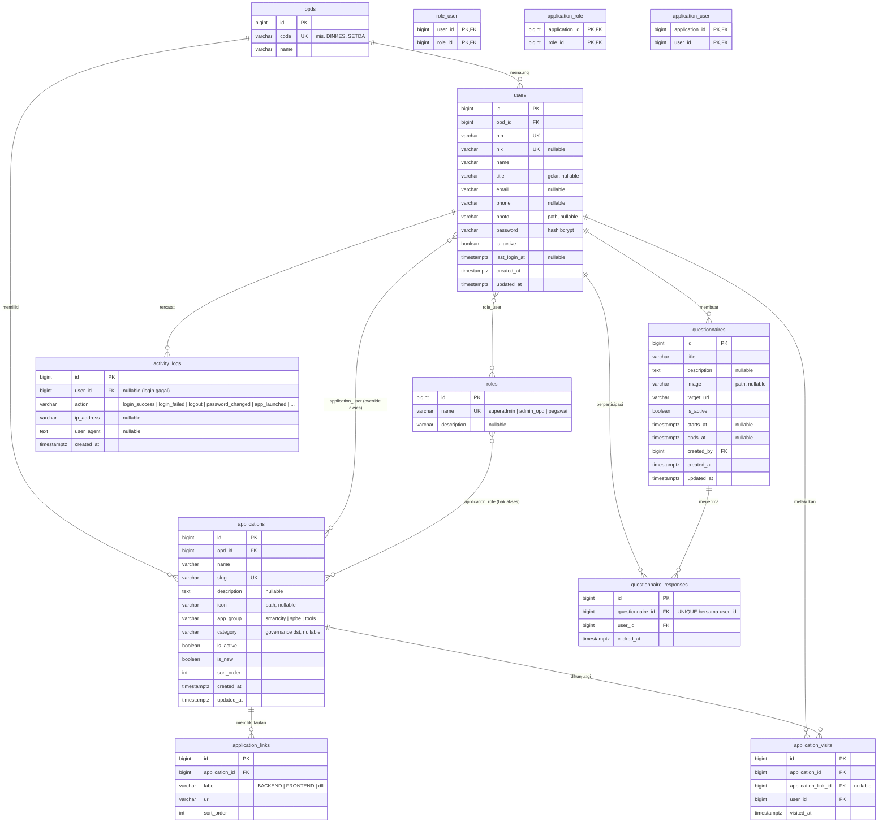

# ERD — Rebuild E-Office Banyumas

**Tanggal:** 9 Juli 2026 — Fase 0, Hari 2
**Status:** v1.0 — dirancang dari inventarisasi fitur (`docs/inventaris/`) + 30 screenshot; menunggu konfirmasi pembimbing (lihat §6 Kontingensi)
**Database target:** PostgreSQL 17 · **ORM:** Laravel 13 Eloquent

> File pendamping: `schema.sql` (DDL PostgreSQL siap uji — sumber kebenaran teknis jika ada perbedaan dengan diagram).

---

## 1. Diagram ER (Mermaid — dirender otomatis oleh GitHub)



---

## 2. Daftar Relasi & Kardinalitas

| # | Relasi | Kardinalitas | Via | Keterangan |
|---|---|---|---|---|
| R1 | opds → users | 1 : N | `users.opd_id` | Setiap user milik satu OPD; OPD punya banyak user |
| R2 | opds → applications | 1 : N | `applications.opd_id` | Label OPD pemilik di kartu aplikasi (ss_02, ss_18) |
| R3 | users ↔ roles | M : N | `role_user` | Satu user bisa multi-role (mis. pegawai sekaligus admin OPD) |
| R4 | applications ↔ roles | M : N | `application_role` | **Inti RBAC**: hak akses per role |
| R5 | applications ↔ users | M : N | `application_user` | Override akses per user (aditif terhadap R4) |
| R6 | applications → application_links | 1 : N | `application_links.application_id` | 1–3+ tombol per kartu: BACKEND, FRONTEND, V2, dst. (ss_02, ss_20, ss_21) |
| R7 | applications → application_visits | 1 : N | `application_visits.application_id` | Sumber penghitung "pengunjung bulan/tahun ini" |
| R8 | users → application_visits | 1 : N | `application_visits.user_id` | Kunjungan selalu oleh user login |
| R9 | questionnaires → questionnaire_responses | 1 : N | `questionnaire_responses.questionnaire_id` | Penghitung partisipasi kuisioner |
| R10 | users → questionnaire_responses | 1 : N | `questionnaire_responses.user_id` | **UNIQUE (questionnaire_id, user_id)** — satu user dihitung sekali |
| R11 | users → questionnaires | 1 : N | `questionnaires.created_by` | Admin pembuat kuisioner |
| R12 | users → activity_logs | 1 : N | `activity_logs.user_id` | Nullable untuk percobaan login gagal |

---

## 3. Kamus Data (kolom kunci per tabel)

### `users`
| Kolom | Tipe | Constraint | Keterangan |
|---|---|---|---|
| id | bigint | PK, identity | |
| opd_id | bigint | FK → opds, NOT NULL, ON DELETE RESTRICT | Dasar penetapan role/akses per OPD |
| nip | varchar(20) | UNIQUE, NOT NULL | Identitas login utama |
| nik | varchar(20) | UNIQUE, NULL | Identitas login alternatif (placeholder "NIP atau NIK", ss_28) |
| name | varchar(150) | NOT NULL | |
| title | varchar(50) | NULL | Gelar, tampil di navbar ("S.Kom.") |
| password | varchar(255) | NOT NULL | Hash bcrypt/argon2 |
| is_active | boolean | NOT NULL DEFAULT true | Nonaktifkan tanpa hapus |
| last_login_at | timestamptz | NULL | |

### `applications`
| Kolom | Tipe | Constraint | Keterangan |
|---|---|---|---|
| id | bigint | PK, identity | |
| opd_id | bigint | FK → opds, NOT NULL, ON DELETE RESTRICT | |
| name | varchar(150) | NOT NULL | |
| slug | varchar(150) | UNIQUE, NOT NULL | Untuk route `/launch/{slug}` |
| app_group | varchar(20) | NOT NULL, CHECK IN ('smartcity','spbe','tools') | Tab dashboard: Smart City (123)/SPBE (26)/Tools (6). ⚠️ dinamai `app_group` karena `group` adalah reserved keyword SQL |
| category | varchar(30) | NULL, CHECK IN ('governance','economy','kinerja','gawai','rencana','uang','pajak','kesehatan','data','wisata','umum') | Badge kategori (ss_01, ss_12) |
| is_active | boolean | NOT NULL DEFAULT true | Filter Aktif (64)/Tidak Aktif (67) |
| is_new | boolean | NOT NULL DEFAULT false | Tab "Aplikasi Baru" |
| sort_order | int | NOT NULL DEFAULT 0 | |

### `application_links`
| Kolom | Tipe | Constraint | Keterangan |
|---|---|---|---|
| id | bigint | PK, identity | |
| application_id | bigint | FK → applications, NOT NULL, ON DELETE CASCADE | |
| label | varchar(50) | NOT NULL | "BACKEND", "FRONTEND", "BACKEND V2", "FULL CYCLE", dst. |
| url | varchar(500) | NOT NULL | |
| UNIQUE | | (application_id, label) | Tidak ada label ganda per aplikasi |

### `application_visits`
| Kolom | Tipe | Constraint | Keterangan |
|---|---|---|---|
| id | bigint | PK, identity | |
| application_id | bigint | FK → applications, NOT NULL, ON DELETE CASCADE | Denormalisasi ringan agar agregasi cepat |
| application_link_id | bigint | FK → application_links, NULL, ON DELETE SET NULL | Tautan mana yang diklik (opsional, analitik) |
| user_id | bigint | FK → users, NOT NULL, ON DELETE CASCADE | |
| visited_at | timestamptz | NOT NULL DEFAULT now() | |
| INDEX | | (application_id, visited_at) | Untuk hitung bulan/tahun berjalan |

### `application_role` & `application_user` (pivot RBAC)
Composite PK; ON DELETE CASCADE dua arah. Kehadiran baris = akses diberikan (model **aditif**, tidak ada baris "deny").

### `questionnaires`
| Kolom | Tipe | Constraint | Keterangan |
|---|---|---|---|
| target_url | varchar(500) | NOT NULL | Tautan kuisioner (asumsi A2: eksternal/Google Form) |
| is_active | boolean | NOT NULL DEFAULT true | Popup menampilkan kuisioner aktif dalam periode `starts_at`–`ends_at` |
| created_by | bigint | FK → users, NOT NULL, ON DELETE RESTRICT | |

### `questionnaire_responses`
| Kolom | Tipe | Constraint | Keterangan |
|---|---|---|---|
| questionnaire_id + user_id | | **UNIQUE** | Aturan "satu user dihitung sekali" ditegakkan di DB, bukan hanya di aplikasi |
| clicked_at | timestamptz | NOT NULL DEFAULT now() | |

### `activity_logs`
`user_id` nullable (login gagal sebelum identitas terverifikasi); `action` varchar bebas terkontrol dari konstanta aplikasi; index (user_id, created_at).

---

## 4. Aturan Bisnis pada Level Data

**AB1 — Akses efektif user terhadap aplikasi (jantung RBAC):**
```
aplikasi_boleh_diakses(user) =
    aplikasi AKTIF yang:
      terhubung ke salah satu role user via application_role
      ∪ terhubung langsung ke user via application_user
    (user ber-role superadmin melewati filter: melihat semua)
```
Query ini dipakai di DUA tempat dan harus SATU sumber (satu scope/service): (a) grid dashboard (MAU), (b) middleware route `/launch/{slug}` (HNR). Jangan diduplikasi.

**AB2 — Penghitung kunjungan:** "N pengunjung bulan ini" = `COUNT(*)` dari `application_visits` dengan `visited_at` dalam bulan berjalan; "tahun ini" idem. Dihitung dari data mentah (bukan kolom counter) agar tidak pernah melenceng; index R7 menjamin cepat pada skala KP.

**AB3 — Partisipasi kuisioner:** klik "Isi Kuisioner" → `INSERT` ke `questionnaire_responses`; duplikat ditolak constraint UNIQUE → tangkap error, perlakukan sebagai idempoten. Statistik: total respon, % terhadap `COUNT(users WHERE is_active)`.

**AB4 — Popup:** tampilkan kuisioner `is_active = true` dan `now() BETWEEN starts_at AND ends_at` (null = tanpa batas); user yang sudah punya baris respons tidak ditampilkan popup lagi.

**AB5 — Integritas penghapusan:** OPD tidak bisa dihapus selama masih punya user/aplikasi (RESTRICT); menghapus aplikasi ikut menghapus tautan, kunjungan, dan baris aksesnya (CASCADE); kuisioner tidak bisa dihapus jika pembuatnya dihapus (RESTRICT pada created_by — nonaktifkan user, jangan hapus).

---

## 5. Keputusan Desain (untuk Bab 4 laporan)

| # | Keputusan | Alasan |
|---|---|---|
| D1 | Pivot murni (`role_user`, `application_role`, `application_user`) memakai **composite PK**; tabel event (`visits`, `responses`) memakai surrogate `id` | Pivot tak butuh identitas sendiri; tabel event butuh untuk referensi & pagination |
| D2 | `group` → **`app_group`** | `GROUP` reserved keyword SQL; menghindari quoting & bug query builder |
| D3 | Enum via **varchar + CHECK constraint**, bukan tipe ENUM PostgreSQL | Mudah dimigrasi/diubah di Laravel, tetap tervalidasi di DB |
| D4 | Penghitung kunjungan **dihitung dari tabel event**, bukan kolom `visit_count` | Konsistensi > mikro-optimasi; skala data KP kecil |
| D5 | Semua waktu **timestamptz** | Aman zona waktu (WIB) |
| D6 | Aturan unik "1 user 1 respon" ditegakkan **di database** (UNIQUE), bukan hanya validasi aplikasi | Fondasi tidak boleh bergantung pada disiplin kode |
| D7 | Model akses **aditif** (union role + override user), tanpa baris "deny" | Sederhana, cukup untuk kebutuhan yang diminta; deny-list menambah kompleksitas tanpa permintaan |

---

## 6. Asumsi & Kontingensi (menunggu jawaban pembimbing)

| # | Asumsi yang dipakai ERD v1.0 | Jika jawaban pembimbing berbeda → dampak |
|---|---|---|
| A1 | User berdiri sendiri (tidak sinkron Simpeg/BKPSDM) | Tambah kolom `simpeg_id` + job sinkronisasi; struktur inti tidak berubah |
| A2 | Kuisioner = **tautan eksternal** (Google Form); yang disimpan hanya klik partisipasi | Jika form internal: tambah tabel `questionnaire_questions` (id, questionnaire_id, question, type, options jsonb, sort_order) dan `questionnaire_answers` (id, response_id, question_id, answer text) — ERD inti tetap; `questionnaire_responses` menjadi induk jawaban |
| A3 | Role minimal 3: `superadmin`, `admin_opd`, `pegawai`; pembatasan akses utamanya per role/OPD | Jika per-user murni: `application_user` sudah menampung; jika per-jabatan: tambah tabel `positions` |
| A4 | Satu kuisioner aktif bisa >1 (popup menampilkan yang terbaru/carousel) | Jika dibatasi satu: tegakkan di logika aplikasi, DB tidak berubah |
| A5 | SSO = tautan keluar biasa (tanpa token) | Jika token/redirect: tambah kolom di `application_links` (mis. `requires_token`), mekanisme di service — DB nyaris tak berubah |

Semua kontingensi sengaja dirancang **aditif** — tidak ada jawaban pembimbing yang akan memaksa bongkar tabel inti.

---

## 7. Checklist Verifikasi ERD ↔ Kebutuhan Fungsional

| FR | Terpenuhi oleh |
|---|---|
| FR-A01 (login NIP/NIK) | `users.nip`, `users.nik` UNIQUE |
| FR-A08–A11 (RBAC + admin) | `roles`, `role_user`, `application_role`, `application_user` |
| FR-A12 (log aktivitas) | `activity_logs` |
| FR-D02 (tab/filter/cari) | `applications.app_group`, `category`, `is_active`, `is_new`, `name` |
| FR-D03 (kartu + multi-tautan) | `applications` + `application_links` + `opds` |
| FR-D04 (penghitung kunjungan) | `application_visits` + index bulan/tahun |
| FR-D06 (grid sesuai hak akses) | AB1 |
| FR-D07–D10 (popup kuisioner + statistik + CRUD) | `questionnaires`, `questionnaire_responses` (UNIQUE) |

Tidak ada FR dari kedua dokumen inventarisasi yang tidak terpetakan ke struktur data. ✅
